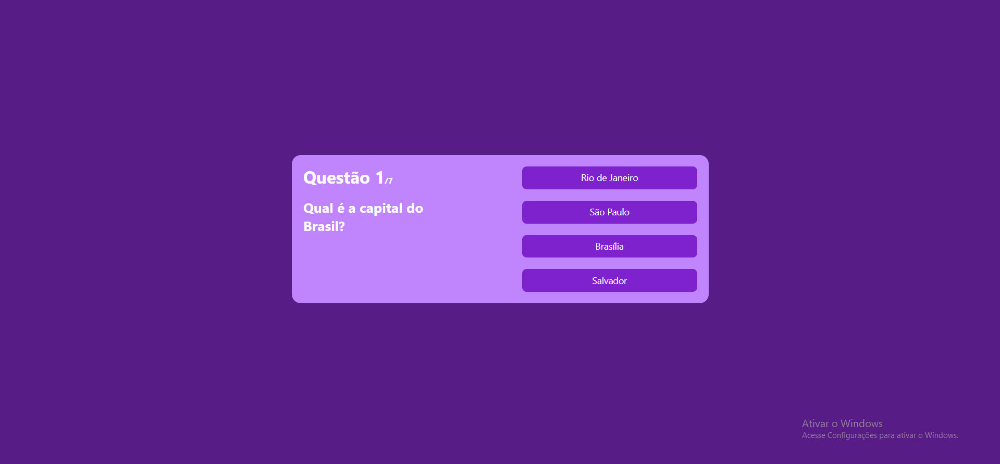
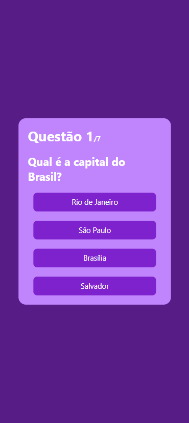

<h1>Quiz Game - React</h1>

Esse é um projeto de um Jogo de Quiz, no qual o usuário escolhe entre 4 alternativas por questão, e no final do jogo é mostrada a pontuação do usuário.

A aplicação é responsível tanto para Desktop quanto para Celular.

<h3>Tecnologias:</h3>
<ul>
  <li>React</li>
  <li>Tailwind CSS</li>
</ul>

<h3>Desktop</h3>

<h3>Mobile</h3>

